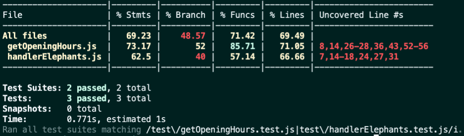

Welcome to the Zoo Functions project repository!
To complete the project, pay attention to each step described below, and if you have any questions, send them to us via Slack! #vqv 🚀

Here you will find the details on how to structure the development of your project from this repository, using a specific branch and a Pull Request to submit your code.

Terms and Agreements
When starting this project, you agree to the guidelines of the Trybe Student Code of Conduct and Manual.

Deliverables
<details>
    <summary><strong>🤷🏽‍♀️ How to Deliver</strong></summary><br />
To deliver your project, you should create a Pull Request in this repository.

Remember that you can consult our content on Git & GitHub and our Blog - Git & GitHub whenever you need!

</details>
<details>
<summary><strong>🧑‍💻 What Should Be Developed</strong></summary><br />
Knowing your skills with ES6, Higher Order Functions, and tests, the city's government has given you an important mission: organize information about the zoo! 🐘

You will be responsible for developing functions that retrieve information about the zoo's animals, such as species and place of origin. Additionally, you will also gather data about the people who collaborate in the maintenance and care of the zoo. 🧑‍🌾

And it doesn't stop there! 🤩

You've already learned about the importance of having a test-oriented mindset, haven't you? You also know how implementing tests contributes to writing more reliable and performant code.

The sequence of requirements for this project has been arranged to provide you with the experience of understanding in practice how test-driven development helps ensure high-quality code. To do this, you will implement tests for existing functions, understanding the use cases of your application and ensuring it works correctly! 🚀

</details>
<details>
<summary><strong>🗓 Delivery Date</strong></summary><br />
This project is individual

There are 4 project days

Project delivery date: 08/09/2022 14:00

</details><br />
Guidelines
<details>
<summary><strong>‼ Before You Start Developing</strong></summary><br />
Clone the repository

Use the command: git clone git@github.com:tryber/sd-024-a-project-zoo-functions.git
Enter the repository folder you just cloned:

cd sd-024-a-project-zoo-functions
Install dependencies

To do this, use the following command: npm install
Create a branch from the main branch

Make sure you are on the main branch
Example: git branch
If you're not, switch to the main branch
Example: git checkout main
Now, create a branch for your project's commits:
You should create a branch in the following format: username-project-name
Example: git checkout -b luiza-zoo-functions-project
Add changes to the Git stage and make a commit

Check that the changes are not yet in the stage

Example: git status (the files in the src directory should appear in red)
Add the new file to the Git stage

Example: git add . (adding all changes - that were in red - to the Git stage)
git status (should list the files in the src directory in green)
Make the initial commit

Example: git commit -m 'Starting the project. LET'S GO :rocket:' (making the first commit)
git status (should display a message like nothing to commit )

Add your branch with the new commit to the remote repository

Using the previous example: git push -u origin luiza-zoo-functions-project
Create a new Pull Request (PR)

Go to the GitHub repository's Pull Requests page
Click the green "New pull request" button
Click the "Compare" checkbox and choose your branch carefully
Add a title to your Pull Request
Example: "Create search screen"
Click the green "Create pull request" button
Add a description to the Pull Request and click the green "Create pull request" button again
Don't worry about filling in anything else for now!
Go back to the repository's Pull Requests page and check that your Pull Request is created.
</details>
<details>
<summary><strong>⌨️ During Development</strong></summary><br />
Commit changes to your code regularly;
Remember to always update the remote repository after one (or more) commits;
The commands you will use most frequently are:
git status (to check what's in red - outside of the stage - and what's in green - in the stage);
git add (to add files to the Git stage);
git commit (to create a commit with the files in the Git stage);
git push -u origin branch-name (to send the commit to the remote repository the first time you push a new branch);
git push (to send the commit to the remote repository after the previous step).
</details>
<details>
<summary><strong>🤝 After Completing Development (optional)</strong></summary><br />
To indicate that your project is ready for your colleagues' Code Review, do the following:

Go to YOUR Pull Request page, add the code-review label, and mention your colleagues:
On the right menu, click the 'Labels' link and choose the code-review label;
On the right menu, click the 'Assignees' link and choose your username;
On the right menu, click the 'Reviewers' link and type students, select the team tryber/students-sd-024-a.
If you have any doubts, here's an explanatory video.

⚠️ Remember to ensure that all issues commented by the Linter are resolved! ⚠️

</details>
<details>
<summary><strong>🕵🏿 Reviewing a Pull Request</strong></summary><br />
Use the Code Review content to help you review Pull Requests.

</details>
<details>
<summary><strong>🎛 Linter</strong></summary><br />

We will use [ESLint](https://eslint.org/) to do static analysis of your code.

To guarantee the quality of the code, we will use `ESLint` in this project. This way the code will be aligned with good development practices, being more readable and easier to maintain!

To be able to run `ESLint` make sure you have run the `npm install` command within the project.

To run them locally in the project, run the commands below:

```bash
npm run lint
```

If `ESLint` analysis finds problems in your code, those problems will be shown in your terminal. If there is no problem in your code, nothing will be printed to your terminal.

You can also install the `ESLint` plugin in `VSCode`. To do this, simply download the [`ESLint` plugin](https://marketplace.visualstudio.com/items?itemName=dbaeumer.vscode-eslint) and install it.

If you have any questions, check out the material on the platform about [ESLint and Stylelint](https://app.betrybe.com/course/real-life-engineer/eslint).

⚠️ **PULL REQUESTS WITH ISSUES IN THE LINTER WILL NOT BE EVALUATED. BE CAREFUL TO RESOLVE THEM BEFORE FINALIZING DEVELOPMENT!** ⚠️

</details>

<details>
<summary><strong>🛠 Tests</strong></summary><br />

For the tests to be run locally, check that the node version on your machine is `16`:

```bash
node -v
```

If the version is different, you can use `nvm` to change the version with the following command:

```bash
nvm use 16
```

If you do not have `nvm` installed on your machine, you can consult the [content for installing nvm](https://app.betrybe.com/course/fundamentals/introducao-a-javascript-e-logica-de -programacao/javascript-près-passos/33d74e1e-05b9-4ce8-86e3-623c96afe64d/conteudos/60b99b90-bcd4-4189-9198-3389f7f742f3/instalacao-do-node-para-linux/156d871d-97f2-416 9-b766-85e4e56812ac ?use_case=side_bar)

All project requirements will be **automatically** tested through `Jest`.

To test all functions in the terminal, simply run the command below:

```bash
npm test
```

If you want to test just one function, run the command below:

```bash
npm test filename
```

For example:

```bash
npm test getSpeciesByIds
```

## Test coverage

In this project you will need to implement tests for two already created functions: `handlerElephants` and `getOpeningHours`.

This coverage evaluates the effectiveness of the tests implemented according to the requirements, determining whether they cover what was requested or not.

**Observation:**
- It is important to highlight that the `getOpeningHours` function has specific logic to validate the times 12am and 12pm. Therefore, for full coverage, your tests must also check how the function behaves when receiving these times.

⚠️ **Only the two requested functions will be tested and not the entire application!**

As you test the project, the percentage of total coverage will increase. For each test requirement, a percentage of coverage will be evaluated.

To run and monitor the implementation of your test coverage, run the command below:

```bash
npm run test:coverage
```

When executing the command you will get a result similar to this:



In this project we will focus on covering *statements* (i.e. JavaScript instructions). The percentage of coverage of function instructions will be evaluated, as highlighted in the figure below:


Furthermore, the table will also show which lines are not yet covered by tests. That is, when there is no test case that executes that instruction.

Check with `npm test` that all test coverage items are passing correctly.

⚠️ **Attention**: be careful with possible false positives!

When running the test coverage command, the `coverage` folder will be created, with an `index.html` file. This file presents a coverage analysis report. In this report you can see which lines are **not** being covered by the tests.

⚠️ **The automatic evaluator does not necessarily evaluate your project in the order in which the requirements appear in the readme. This is to make the evaluation process faster. So don't be alarmed if this happens, okay?**

</details>

<details>
<summary><strong>🏗 Project structure</strong></summary><br />

In the project root folder, we have the `src`, `test`, `evaluator` and `data` folders.

The `src` folder is made up of files relating to each of the functions that you will implement, the `data` folder contains the `zoo_data.js` file, which stores the data that you will use to return information about the zoo.

This project also has some requirements for implementing tests. The `test` folder contains the files in which you will implement the unit tests corresponding to each function, the file name is the name of the target function plus the suffix `.test.js`.

**For example:** the `src/getOpeningHours.js` file will contain the implementation of the `getOpeningHours` function and the `test/getOpeningHours.test.js` file must contain the tests that you will develop for it.

The `evaluator` folder has the automated tests that will evaluate your project; the contents of this folder must not be changed.

<details>
   <summary>
     The <code>zoo_data.js</code> file contains an <strong>object</strong> in the following format:
   </summary> <br />

```javascript
{
	species: [
    {
      id: lionId,
      name: 'lions',
      popularity: 4,
      location: 'NE',
      availability: ['Tuesday', 'Thursday', 'Saturday', 'Sunday'],
      residents: [
        {
          name: 'Zena',
          sex: 'female',
          age: 12,
        }
      ],
    }
  ],
  employees: [
    {
      id: 'c5b83cb3-a451-49e2-ac45-ff3f54fbe7e1',
      firstName: 'Nigel',
      lastName: 'Nelson',
      managers: [burlId, olaId],
      responsibleFor: [lionId, tigersId],
    }
  ],
  hours: {
    Tuesday: { open: 8, close: 6 },
    Wednesday: { open: 8, close: 6 },
    Thursday: { open: 10, close: 8 },
    Friday: { open: 10, close: 8 },
    Saturday: { open: 8, close: 10 },
    Sunday: { open: 8, close: 8 },
    Monday: { open: 0, close: 0 },
  },
  prices: {
    adult: 49.99,
    senior: 24.99,
    child: 20.99,
  },
}
```

<details>
   <summary>
   The <code>species</code> array stores information about each species in the zoo
   </summary> <br />

   | Key | Description |
   | ------------ | ----------|
   | `id` | is the species identifier |
   | `name` | is the species name, e.g. `lions` |
   | `popularity` | is the popularity of that species |
   | `location` | is the region that the animal species came from, it can have the following values: <br> - `NE`: northeast; <br> - `NW`: northwest; <br> - `SE`: southeast; <br> - `SW`: southwest. |
   | `availability` | is the availability of visits to animals of this species |
   | `residents` | is information about the animals of that species that reside in the zoo, where: <br> - `name`: is the name of the animal, for example `'Zena'`; <br> - `sex`: is the sex of the animal, for example: `'female'` (female); <br> - `age`: is the age of the animal. |

</details>

<details>
   <summary>
   The <code>employees</code> array is where the information for each employee is located.
   </summary> <br />

   | Key | Description |
   | ----------- | ------ |
   | `id` | is that person's identifier |
   | `firstName` | is this person's first name |
   | `lastName` | is this person's last name |
   | `managers` | are the `ids` of that person's leadership |
   | `responsibleFor` | are the `ids` of the species that this person is responsible for |

</details>

<details>
   <summary>
   The <code>hours</code> object stores information about the zoo's opening hours
   </summary> <br />

   | Key | Description|
   | ------ | ------ |
   | `Tuesday`<br> `Wednesday`<br> `Thursday`<br> `Friday`<br> `Saturday`<br> `Sunday`<br> `Monday` | are the days of the week: <br> - `open`: is the time the zoo opens; <br> - `close`: is the time when the zoo closes. |

</details>

<details>
   <summary>
     The <code>prices</code> object is responsible for storing information about the zoo entrance fee
   </summary> <br />

   | Key | Description |
   | -------- | ------ |
   | `adult` | is the price for adults |
   | `senior` | is the price for seniors |
   | `child` | is the price for children |

</details>

</details>

<br />

⚠️ **Only the files indicated in the requirements must be changed, otherwise your evaluation may be compromised.**

All files strictly necessary to complete the project have already been created, **there is no need to create other files.

</details>

<details>
<summary><strong>🏪 What you should develop </strong></summary><br />

You must complement the functions created within the `src` folder and must create tests for the ready-made functions `handlerElephants` and `getOpeningHours`.

</details>

<details>
<summary><strong>⚛️ Tip</strong></summary><br />
When working with development, you will come across various types of challenges, so it is very important that problems are broken down into smaller parts, so that they can be resolved little by little. This will help you find a solution more easily. Therefore, a good way to start developing a project is to remember that functions are made up of small blocks of logic that have a specific objective.

Don't forget to check what each part of your code returns! You can do this using `console.log`, which is a great ally in visualizing your code! 😉

⚠️ **Pay attention to the return of each part of your code**

</details>

<details>
<summary><strong>🗣 Give us feedback on the project!</strong></summary><br />

When finalizing and submitting the project, don't forget to rate your experience by filling out the form. **Takes less than 3 minutes!**

[Project evaluation form](https://bit.ly/2OfLJPn)

</details>

<details>
<summary><strong>🗂 Share your portfolio!</strong></summary><br />
Did you know that LinkedIn is the main professional social network and sharing your learning there is very important for anyone who wants to build a successful career? Share this project on your LinkedIn, tag Trybe's profile (@trybe) and show your network its evolution.

</details><br />

---

# Mandatory Requirements

⚠️ **PULL REQUESTS WITH ISSUES IN THE LINTER WILL NOT BE EVALUATED. BE CAREFUL TO RESOLVE THEM BEFORE FINALIZING DEVELOPMENT!** ⚠️

## 1. Implement the `getSpeciesByIds` function.

<details>
   <summary>
   Implement the <code>getSpeciesByIds</code> function to search for animal species using an <code>ID</code> and return an array containing all animals of that species.
   </summary> <br />

- Make the `getSpeciesByIds` function able to receive multiple parameters;

- Return an empty array if the function does not receive an `id`;

- Return the following information from the `data` file:

   - If the function receives only one `id`, return the species of the animal referring to this `id`;

   - If the function receives several `ids`, return all species referring to these `ids`.

**What will be tested:**

- The `getSpeciesByIds` function, if it does not receive any parameters, must return an empty array;

- The `getSpeciesByIds` function, if it receives a single `ID` as a parameter, must return an array with the species referring to that `ID`;

- The `getSpeciesByIds` function, if it receives more than one `ID`, must return an array with the species referring to the `IDs`.

</details>

---

## 2. Implement the `getAnimalsOlderThan` function.

<details>
   <summary>
   Implement the function <code>getAnimalsOlderThan</code> which must receive a species and an age as a parameter, and then return whether all animals of that species are that age or older.
   </summary> <br />

- Check that all animals of the species given as a parameter have the minimum age:
   - Animals must be this age or older.

- Return a boolean value.

**What will be tested:**

- The function, when receiving a species and an age as parameters, must test whether all animals of this species have the specified minimum age.

</details>

---

## 3. Implement the `getEmployeeByName` function.

<details>
   <summary>
     Implement the <code>getEmployeeByName</code> function that must search for employees using their first or last name.
   </summary> <br />

- Return an empty object if the function does not receive parameters;

- Return the information of the contributing person if the parameter is equal to the name **or** equal to the last name in the following format:

```javascript
   {
     id: 'c5b83cb3-a451-49e2-ac45-ff3f54fbe7e1',
     firstName: 'Nigel',
     lastName: 'Nelson',
     managers: ['0e7b460e-acf4-4e17-bcb3-ee472265db83', 'fdb2543b-5662-46a7-badc-93d960fdc0a8'],
     responsibleFor: ['0938aa23-f153-4937-9f88-4858b24d6bce', 'e8481c1d-42ea-4610-8e11-1752cfc05a46'],
   }
```

**What will be tested:**

- The function must return an empty object if it does not receive parameters;

- The function must return the object of the collaborating person if it receives their first name as a parameter;

- The function must return the object of the collaborating person if it receives their last name as a parameter.


</details>

---

## 4. Implement the `getRelatedEmployees` function.

<details>
   <summary>
     Implement the <code>getRelatedEmployees</code> function to check whether a contributing person is a manager and which people they lead.
   </summary> <br />

- Considering the good practice of dividing the code into smaller parts, the file will have two functions:

1. The `isManager` function will be responsible for checking whether a contributing person is a manager:
     - Must return `true` if the `id` passed is that of a manager;
     - Must return `false` if the `id` passed is not that of a manager.

2. The `getRelatedEmployees` function will be responsible for returning the people led by management:
       - Use the `isManager` function to check whether the person is a manager or not and carry out the following checks:

         - If the person is a manager, return an array containing the name and surname of the collaborating people managed by that person.

         Example output:

         ```javascript

         [ 'Burl Bethea', 'Ola Orloff', 'Emery Elser' ];

         ```

         - If the person is not a manager, trigger an error with the message: **'The id entered does not belong to a manager!'**.
  
         To throw the error, you will use the **Error** constructor function from the JavaScript standard library.

         Example:

         ```javascript

         throw new Error('The id entered is not that of a manager!');

         ```

         You can read more about the [constructor function **Error**, at this link.](https://developer.mozilla.org/pt-BR/docs/Web/JavaScript/Reference/Global_Objects/Error)
         
         **What will be tested:**

   - The `isManager` function must return `true` if the `ID` passed is that of a manager;

   - The `isManager` function must return `false` if the `ID` passed is not that of a manager;

   - The `getRelatedEmployees` function, if the `ID` passed is that of the manager, must return an array containing the name and surname of the collaborators for whom it is responsible;

   - The `getRelatedEmployees` function, if the `ID` passed **not** belongs to the manager, should trigger an error with the message: `'The id entered is not that of a manager!'`.

</details>

---

## 5. Implement the `countAnimals` function.

<details>
   <summary>
     Implement the function <code>countAnimals</code> which should count the number of animal species residing in the zoo.
   </summary> <br />

- The `countAnimals` function is responsible for counting the number of animals that reside in the zoo.
  
- Return the number of resident animals by species if no parameter is passed. The return must be an object whose name of each species is the key and the total number of animals (residents) of that species is the value. For example:

```javascript
   {
     lions: 4,
     // [...]
   }
```

- Return the number of animals residing in the zoo of the species passed by parameter. For example:

   - when receiving the argument `{ specie: 'penguins' }`, it returns only the quantity (number) of penguins that reside in the zoo;

   - when passing the argument `{ specie: 'giraffes', sex: 'female' }`, it returns only the quantity (number) of female giraffes that reside in the zoo.

**What will be tested:**

- The `countAnimals` function, if it does not receive any parameters, must return all species and the number of residents of each one;

- The `countAnimals` function, if it receives an object with the key `specie` as a parameter, must return the number of animals of that species;

- The `countAnimals` function, if it receives an object with the keys `specie` and `sex` as a parameter, must return the number of animals of that species, in the selected sex.

</details>

---

## 6. Get at least 80% test coverage in the `handlerElephants` function.

<details>
   <summary>
     Implement the <code>handlerElephants</code> function tests to obtain at least 80% coverage
   </summary> <br />

This function returns information regarding elephants according to the argument passed:

| Argument | Information |
| --------- | ---------- |
| `count` | returns the number of elephants |
| `names` | returns an array with the list of names of all elephants |
| `averageAge` | returns the average age of elephants |
| `location` | returns the location of elephants inside the Zoo |
| `popularity` | Elephant popularity returns |
| `availability` | returns an array with the list of days on which it is possible to visit the elephants |

> **Keep an eye on the tip 👀:** Before you start writing tests, read the `handlerElephants` function and try to understand it line by line

- Implement the tests in the files in the `test` folder in the root of the project;

- The `handlerElephants` function is already implemented, it is only necessary to create the tests;

- The function is case sensitive;

- Use the `npm test handlerElephants` command to check if your tests are passing;

- Use the `npm run test:coverage` command to test coverage.

**Coverage will only check the highlighted functions and not the entire application!**

⚠️ **Attention:** do not change the structure already implemented in the test files, just add the tests within the `describe` block.

<details>
   <summary>
     💡 <strong>Tips on what you can test:</strong>
   </summary> <br />

⚠️ **Attention:** The topics below are just suggestions, feel free to test what you think is necessary as long as the function coverage reaches at least 80%

- For the `count` argument, the integer `4` must be returned;

- For the `names` argument, it must return an array of names that has the name `Jefferson`;

- For the `averageAge` argument, it must return a number close to `10.5`;

</details>

</details>

---

## 7. Get at least 90% test coverage in the `handlerElephants` function.

<details>
   <summary>
     Implement the <code>handlerElephants</code> function tests to obtain at least 90% coverage
   </summary> <br />

This function returns information regarding elephants according to the argument passed:

| Argument | Information |
| --------- | ---------- |
| `count` | returns the number of elephants |
| `names` | returns an array with the list of names of all elephants |
| `averageAge` | returns the average age of elephants |
| `location` | returns the location of elephants inside the Zoo |
| `popularity` | Elephant popularity returns |
| `availability` | returns an array with the list of days on which it is possible to visit the elephants |

- The function is case sensitive;

- Use the `npm test handlerElephants` command to check if your tests are passing;

- Use the `npm run test:coverage` command to test coverage.

⚠️ **Attention:** do not change the structure already implemented in the test files, just add the tests within the `describe` block.

<details>
   <summary>
     💡 <strong>Tips on what you can test:</strong>
   </summary> <br />

⚠️ **Attention:** The topics below are just suggestions, feel free to test what you think is necessary as long as the function coverage reaches at least 90%.

- For the `count` argument, the integer `4` must be returned;

- For the `names` argument, it must return an array of names that has the name `Jefferson`;

- For the `averageAge` argument, it must return a number close to `10.5`;

- For the `location` argument, the string `NW` must be returned;

- For the `popularity` argument, a number equal to or greater than 5 must be returned;

- For the `availability` argument, it must return an array of days of the week that does not contain `Monday`;

- By not passing arguments, the function must return `undefined`;

</details>

</details>

---

## 8. Implement the `calculateEntry` function.

<details>
   <summary>
     Calculate the total entry fee for zoo visitors.
   </summary> <br />

The value of zoo entrance fees is calculated based on the age group, where:

   - `child`: are people **under** 18 years old;

   - `adult`: people aged **greater than or equal** to 18 years old **and younger** than 50 years old;

   - `senior`: people aged **greater than or equal** to 50 years old.

Considering the good practice of dividing the code into smaller parts, the file will have two functions, called `countEntrants` and `calculateEntry`.

The two functions receive an array in the following format:

```javascript
const entrants = [
{ name: 'Lara Carvalho', age: 5 },
{ name: 'Frederico Moreira', age: 5 },
{ name: 'Pedro Henrique Carvalho', age: 5 },
{ name: 'Maria Costa', age: 18 },
{ name: 'Núbia Souza', age: 18 },
{ name: 'Carlos Nogueira', age: 50 },
];
```

1. The `countEntrants` function will be responsible for calculating the number of visitors by age group:

   It receives an array and must return an **object**. For that:

   - Calculate the number of visitors by age group;

   - Return an object in a format like this: `{ child: 3, adult: 2, senior: 1 }`.

2. The `calculateEntry` function will be responsible for adding up the entry value of people at the zoo:

   It receives an array and must return the **total** sum of the ticket values. For that:

   - Return `0` if no parameter is passed or it is an empty array;

   - Use the `countEntrants` function to have the total number of people by age group;

   - Calculate the ticket prices by age group. Your return should look like this: `187.94`.

> **Keep an eye on the tip 👀:** The amount to be charged for the age range is also included in the data file.

**Example of using the `calculateEntry` function:**

```javascript
calculateEntry(entrants);
```

**Exit:**

```javascript
187.94
```

**What will be tested:**

- The `countEntrants` function:

   - When receiving an array of visitors, it returns an object with the count.

- The `calculateEntry` function:

   - Returns 0 if no arguments are passed;

   - Returns 0 if an empty object is passed;

   - When receiving an array of people with 3 children, 2 adults and 1 older person, it returns the correct value;

   - When receiving an array with 1 adult person, it returns the correct value;

   - When receiving an array with 1 older person, it returns the correct value;

   - When receiving an array with 1 child, it returns the correct value;

   - When receiving an array with 1 child and 1 older person, it returns the correct value.

</details>

---

## 9. Implement the `getSchedule` function.

<details>
   <summary>
    Implement the <code>getSchedule</code> function that will provide a schedule with the weekly visiting times available for each species of animal.
   </summary> <br />

   Information about animal schedules should be made available in a query for people visiting the zoo, who may want to access the schedule for the week, a day or a specific animal.

   - Return an array with the days of the week on which an animal is available for visitation if the function parameter is an animal. For example: `[ 'Tuesday', 'Thursday', 'Saturday', 'Sunday' ]`;

    Return all available times for each day of the week if the function:

     - do not receive parameter;

     - the parameter passed to the function is not an animal or a day;

   For that:

   - Create an object and add all days of the week as a key;

   - The values for each day of the week must be an object, having the keys `officeHour` and `exhibition`:

     - `officeHour` must have the text with the time that the zoo opens and closes on that day of the week;

     - `exhibition` must have an array with the name of all animals available for visitation on that day of the week.

<details>
   <summary>
     The return should look like this:
   </summary> <br />

   ```javascript
   {
     Tuesday: { // Day of the week
       officeHour: 'Open from 8am until 6pm', //n
       exhibition: [ 'lions', 'tigers', 'bears', 'penguins', 'elephants', 'giraffes' ],
     },
     Wednesday: {
       officeHour: 'Open from 8am until 6pm',
       exhibition: [ 'tigers', 'bears', 'penguins', 'otters', 'frogs', 'giraffes' ],
     },
     // [...]
   }
   ```

</details>

> **Keep an eye on the tip 👀:** Break the problem into smaller functions so that it becomes simpler to manage the responsibility of each one.

**What will be tested:**

- The function, if it receives the name of an animal as a parameter, must return an array with the days on which it will be on display;

- If the function does not receive parameters, it must return the times for each day and which animals will be available;

- The function, if it receives parameters that are neither an animal nor a day, returns the times for each day and which animals will be available;

- The function, if it receives a single day per parameter, must return the times for that day and which animals will be available.


</details>

---

## 10. Implement the `getOldestFromFirstSpecies` function.

<details>
   <summary>
     Implement the function <code>getOldestFromFirstSpecies</code> which should find the oldest animal of the species managed by a collaborating person.
   </summary> <br />

- The function receives an `ID` parameter referring to the collaborating person and from that `ID`:

   - The function must find the collaborating person who has the `ID` passed as a parameter;

   - The function must find the **first** species of animal that the collaborating person is responsible for;

   - The function must find the oldest animal of that species;

   - The function should return an array with information about the oldest animal of that species.

**What will be tested:**

- After passing the id of a contributing person, the `getOldestFromFirstSpecies` function should find the first species of animal managed by that person, and return an array with the name, sex and age of the oldest animal of that species.

</details>

---

## 11. Implement the `getEmployeesCoverage` function.

<details>
   <summary>
     Implement the function <code>getEmployeesCoverage</code> which should return information about the contributing person and which species they are responsible for.
   </summary> <br />

- The function will receive an object as a parameter that will determine its behavior, being:

   - `name`: the name **or** surname of the person to be searched for;

   - `id`: the id of the person to be searched for.

- The function must return an object in the following format:

```javascript
{
id: "4b40a139-d4dc-4f09-822d-ec25e819a5ad", // person id
fullName: "Sharonda Spry", // full name: firstName + lastName
species: [ "otters", "frogs" ], // species the person is responsible for
locations: [ "SE", "SW" ], // An array containing all species locations
}
```

For that:

   - Return the corresponding person information when receiving an object with the `name` property:
     - the `name` property can have as its value the first or last name of the person contributing, so ensure that your code works both ways.

   - Return the information of the corresponding person when receiving an object with the `id` property;

   - Return an array with information about **all** collaborators if the function does not receive a parameter;

   - Throw an error if the `id` is invalid.


**Examples of using the `getEmployeesCoverage` function:**

   <details>
     <summary>
       If the parameter is an object with name and id, return the information of the contributing person
     </summary> <br />

**PROHIBITED:**

```javascript
getEmployeesCoverage({ name: 'Sharonda' }); // name takes the first name as a parameter or
getEmployeesCoverage({ name: 'Spry' }); // name takes the last name as a parameter or
getEmployeesCoverage({ id: '4b40a139-d4dc-4f09-822d-ec25e819a5ad' }); // receives an id as a parameter
```

**EXIT:**

```json
{
"id": "4b40a139-d4dc-4f09-822d-ec25e819a5ad",
"fullName": "Sharonda Spry",
"species": [ "otters", "frogs" ],
"locations": [ "SE", "SW" ]
}
```

</details>

   <details>
     <summary>
       If the function does not receive parameters, return an array with information on <strong>all</strong> collaborators
     </summary> <br />

**PROHIBITED:**

```javascript
getEmployeesCoverage();
```

**EXIT:**

```javascript
[
{
"id": "c5b83cb3-a451-49e2-ac45-ff3f54fbe7e1",
"fullName": "Nigel Nelson",
"species": [ "lions", "tigers" ],
"locations": [ "NE", "NW" ],
},
{
"id": "0e7b460e-acf4-4e17-bcb3-ee472265db83",
"fullName": "Burl Bethea",
"species": [ "lions", "tigers", "bears", "penguins" ],
"locations": [ "NE", "NW", "NW", "SE" ],
},
{
"id": "fdb2543b-5662-46a7-badc-93d960fdc0a8",
"fullName": "Hello Orloff",
"species": [ "otters", "frogs", "snakes", "elephants" ],
"locations": [ "SE", "SW", "SW", "NW" ],
},
//[...]
];
```

</details>

<details>
   <summary>
     If no person is found with the first name, last name or id, throw an error
   </summary> <br />

If no person is found with the name, surname or id, an error generated with the constructor function **Error** of the JavaScript standard library should be thrown with the message **"Invalid information"**. Example:

```javascript
throw new Error('Invalid information');
```

You can read more about the [constructor function **Error**, at this link.](https://developer.mozilla.org/pt-BR/docs/Web/JavaScript/Reference/Global_Objects/Error)

</details>

<br />

> **Keep an eye on the tip 👀:** Create functions that divide tasks into smaller parts. For example, you can create a `getSpecies` function tasked only with looking up the name of the species that the person is responsible for.

**What will be tested:**

- The function, if the object passed as a parameter has the `name` property, must return only the corresponding person;

- The function may receive as a parameter an object with the `name` property, receiving the second name as the value;

- The function, if the object passed as a parameter has the `id` property, must return only the corresponding person;

- The function, if it does not receive parameters, must return a list with coverage of all collaborating people;

- The function, if there is no person with the specified `name` or `id`, must throw an `error`.

</details>

---

## 12. Get at least 85% test coverage in the `getOpeningHours` function.

<details>
   <summary>
     Implement the <code>getOpeningHours</code> function tests to obtain at least 85% coverage
   </summary> <br />

This function takes as arguments a day of the week and a time, and returns a message informing whether the zoo is open or not on that date and time.

> **Keep an eye on the tip 👀:** Before you start writing tests, read the `getOpeningHours` function and try to understand it line by line.

- Implement the tests in the files in the `test` folder in the root of the project;

- The `getOpeningHours` function is already implemented, it is only necessary to create the tests;

- Use the `npm test getOpeningHours` command to check if your tests are passing;

- Use the `npm run test:coverage` command to test coverage;

- The name of the day of the week used as an argument must be in English;

- The time must have the following format `'XX:XX-XM'`;

- The times will be validated in the nomenclature `'AM'` and `'PM'`;

- The function is not case sensitive;

**Coverage will only check the highlighted functions and not the entire application!**

⚠️ **Attention:** do not change the structure already implemented in the test files, just add the tests within the `describe` block.

<details>
   <summary>
     💡 <strong>Tips on what you can test:</strong>
   </summary> <br />

⚠️ **Attention:** The topics below are just suggestions, feel free to test what you think is necessary as long as the function coverage reaches at least 85%.

- Test not passing arguments. It should return the object:

```javascript
{
Tuesday: { open: 8, close: 6 },
Wednesday: { open: 8, close: 6 },
Thursday: { open: 10, close: 8 },
Friday: { open: 10, close: 8 },
Saturday: { open: 8, close: 10 },
Sunday: { open: 8, close: 8 },
Monday: { open: 0, close: 0 },
}
```

- For the `Monday` and `09:00-AM` arguments, the string `'The zoo is closed'` must be returned (Since the Zoo is always closed on Mondays);

- For the `Tuesday` and `09:00-AM` arguments, the string `'The zoo is open'` must be returned;

- For the `Wednesday` and `09:00-PM` arguments, the string `'The zoo is closed'` must be returned;

</details>

</details>

---

## 13. Get at least 95% test coverage in the `getOpeningHours` function.

<details>
   <summary>
     Implement <code>getOpeningHours</code> function tests to achieve 95% coverage
   </summary> <br />

   This function takes as arguments a day of the week and a time, and returns a message informing whether the zoo is open or not on that date and time.

- Use the `npm test getOpeningHours` command to check if your tests are passing;

- Use the `npm run test:coverage` command to test coverage;

- The name of the day of the week used as an argument must be in English;

- The time must have the following format `'XX:XX-XM'`;

- The times will be validated in the nomenclature `'AM'` and `'PM'`;

- The function is case insensitive.

⚠️ **Attention:** do not change the structure already implemented in the test files, just add the tests within the `describe` block.

<details>
   <summary>
     💡 <strong>Tips on what you can test:</strong>
   </summary> <br />

⚠️ **Attention:** The topics below are just suggestions, feel free to test what you think is necessary as long as the function coverage reaches at least 95%.

- Test not passing arguments. It should return the object:

```javascript
{
Tuesday: { open: 8, close: 6 },
Wednesday: { open: 8, close: 6 },
Thursday: { open: 10, close: 8 },
Friday: { open: 10, close: 8 },
Saturday: { open: 8, close: 10 },
Sunday: { open: 8, close: 8 },
Monday: { open: 0, close: 0 },
}
```

- For the `Monday` and `09:00-AM` arguments, the string `'The zoo is closed'` must be returned (Since the Zoo is always closed on Mondays);

- For the `Tuesday` and `09:00-AM` arguments, the string `'The zoo is open'` must be returned;

- For the `Wednesday` and `09:00-PM` arguments, the string `'The zoo is closed'` must be returned;

- For arguments `Thu` and `09:00-AM` an exception must be thrown with the message: `'The day must be valid. Example: Monday'`

- For the `Friday` and `09:00-ZM` arguments, an exception must be thrown with the message: `'The abbreviation must be \'AM\' or \'PM\''`;

- For the `Saturday` and `C9:00-AM` arguments, an exception must be thrown with the message: `'The hour should represent a number'`;

- For the `Sunday` and `09:c0-AM` arguments, an exception must be thrown with the message: `'The minutes should represent a number'`;

</details>

</details>

---

## 14. Implement the `getAnimalMap` function.

<details>
   <summary>
     Geographically map the animals of each species and perform filters for location, name in alphabetical order and sex.
   </summary> <br />

- The `getAnimalMap` function is responsible for categorizing animals by location, in addition to filtering them by region, name and sex using a parameter. The function return structure is based on the location of the species:

```javascript
   {
     NE: [ /* data here */],
     NW: [/* data here */],
     IF: [/* data here */],
     SW: [/* data here */],
   }
```
  
    The function parameters can be:

    <details>
      <summary>
       <code>includeNames: true</code>, which returns the name of the animals in the following format:
      </summary> <br />

```javascript
   HUH: [
     { lions: ['Zena', 'Maxwell', 'Faustino', 'Dee'] },
     { giraffes: ['Gracia', 'Antone', 'Vicky', 'Clay', 'Arron', 'Bernard'] },
   ],
   // [...]
```
    </details>

<details>
   <summary>
     <code>sorted: true</code> which returns the name of the animals in alphabetical order in the following format:
   </summary> <br />

   ```javascript
   HUH: [
     { lions: ['Dee', 'Faustino', 'Maxwell', 'Zena'] },
     { giraffes: ['Antone', 'Arron', 'Bernard', 'Clay', 'Gracia', 'Vicky'] },
   ],
   // [...]
```
</details>

<details>
   <summary>
     <code>sex: male</code> or <code>sex: female</code> returns the <strong>name</strong> of animals that are male or female in the following format:
   </summary><br />

```javascript
   HUH: [
     { lions: ['Zena', 'Dee'] },
     { giraffes: ['Gracia', 'Vicky'] },
   ],
   // [...]
```

⚠️ **Attention:** If the parameter is `{ sex: male }`, return only the name of the male animals and if the parameter is `{ sex: female }`, return only the name of the female animals.

</details>

<details>
   <summary>
   If the function does not receive a parameter, the animal species must be categorized by location and must return an object in the following format:
   </summary> <br />

   ```javascript
   {
     NE: ['lions', 'giraffes'],
     NW: ['tigers', 'bears', 'elephants'],
     SE: ['penguins', 'otters'],
     SW: ['frogs', 'snakes'],
   }
   ```

</details>

For that:

   - Return the species of all animals categorized by location if the function:

     - do not receive parameter;

     - do not receive the `{includeNames: true}` parameter and only receive the `{sex: female}` parameter;

     - do not receive the `{includeNames: true}` parameter and only receive the `{sex: female, sorted: true}` parameter.

   - Return the species and name of the animals if the function only receives the parameter `{includeNames: true}`;

   - Return the species and name of the animals in alphabetical order if the function receives the parameter `{includeNames: true, sorted: true}`;

   - Return the species and name of animals filtered by sex:

     - Return the species and name of the female animals, if the function parameter is `{includeNames: true, sex: female}`;

     - Return the species and name of the male animals, if the function parameter is `{includeNames: true, sex: male}`;

   - Return the species and name of the animals filtered by sex and in alphabetical order:

     - Return the species and name of female animals in alphabetical order, if the function parameter is `{includeNames: true, sex: female, sorted: true}`;

     - Return the species and name of male animals in alphabetical order, if the function parameter is `{includeNames: true, sex: male, sorted: true}`;
  
> **Keep an eye on the tip 👀:** You don't need to differentiate the sex filters between `female` or `male`, just for `sex`.

**What will be tested:**

- The function, if it does not receive parameters, must return animals categorized by location;

- The function, if it receives a parameter without the `includeNames` option specified, must return animals categorized by location;

- The function, if it receives a parameter with the `includeNames: true` option specified, must return animal names;

- The function, if it receives a parameter with the `sorted: true` option specified, must return ordered animal names;

- The function, if it receives a parameter with the option `sex: 'female'` or `sex: 'male'` specified, must only return names of male/female animals;

- The function, if it receives a parameter with the `sex: 'female'` or `sex: 'male'` option specified and the `sorted: true` option specified, must return only male/female animal names with the names of the animals ordered;

</details>

---

# Bonus Requirements

## 15. Get 100% test coverage on the `handlerElephants` function.

<details>
   <summary>
     Implement <code>handlerElephants</code> function tests to achieve 100% coverage
   </summary> <br />

This function returns information regarding elephants according to the argument passed:

| Argument | Information |
| --------- | ---------- |
| `count` | returns the number of elephants |
| `names` | returns an array with the list of names of all elephants |
| `averageAge` | returns the average age of elephants |
| `location` | returns the location of elephants inside the Zoo |
| `popularity` | Elephant popularity returns |
| `availability` | returns an array with the list of days on which it is possible to visit the elephants |

- The function is case sensitive;

- Use the `npm test handlerElephants` command to check if your tests are passing;

- Use the `npm run test:coverage` command to test coverage.

⚠️ **Attention:** do not change the structure already implemented in the test files, just add the tests within the `describe` block.

<details>
   <summary>
     💡 <strong>Tips on what you can test:</strong>
   </summary> <br />

⚠️ **Attention:** The topics below are just suggestions, feel free to test what you think is necessary as long as the function coverage reaches 100%.

- For the `count` argument, the integer `4` must be returned;

- For the `names` argument, it must return an array of names that has the name `Jefferson`;

- For the `averageAge` argument, it must return a number close to `10.5`;

- For the `location` argument, the string `NW` must be returned;

- For the `popularity` argument, a number equal to or greater than 5 must be returned;

- For the `availability` argument, it must return an array of days of the week that does not contain `Monday`;

- By not passing arguments, the function must return `undefined`;

- Passing an empty object (`{}`) as an argument must return the string `'Invalid parameter, a string is required'`;

- Passing a string that does not include a functionality must return `null`.

</details>
</details>

---

## 16. Get at least 100% test coverage in the `getOpeningHours` function.

<details>
   <summary>
     Implement <code>getOpeningHours</code> function tests to achieve 100% coverage
   </summary> <br />

   This function takes as arguments a day of the week and a time, and returns a message informing whether the zoo is open or not on that date and time.

- Use the `npm test getOpeningHours` command to check if your tests are passing;

- Use the `npm run test:coverage` command to test coverage;

- The name of the day of the week used as an argument must be in English;

- The time must have the following format `'XX:XX-XM'`;

- The times will be validated in the nomenclature `'AM'` and `'PM'`;

- The function is case insensitive.

⚠️ **Attention:** do not change the structure already implemented in the test files, just add the tests within the `describe` block.


   <details>
   <summary>
     💡 <strong>Tips on what you can test:</strong>
   </summary> <br />

⚠️ **Attention:** The topics below are just suggestions, feel free to test what you think is necessary as long as the function coverage reaches at least 100%.

- Test not passing arguments. It should return the object:

```javascript
{
Tuesday: { open: 8, close: 6 },
Wednesday: { open: 8, close: 6 },
Thursday: { open: 10, close: 8 },
Friday: { open: 10, close: 8 },
Saturday: { open: 8, close: 10 },
Sunday: { open: 8, close: 8 },
Monday: { open: 0, close: 0 },
}
```

- For the `Monday` and `09:00-AM` arguments, the string `'The zoo is closed'` must be returned (Since the Zoo is always closed on Mondays);

- For the `Tuesday` and `09:00-AM` arguments, the string `'The zoo is open'` must be returned;

- For the `Wednesday` and `09:00-PM` arguments, the string `'The zoo is closed'` must be returned;

- For arguments `Thu` and `09:00-AM` an exception must be thrown with the message: `'The day must be valid. Example: Monday'`

- For the `Friday` and `09:00-ZM` arguments, an exception must be thrown with the message: `'The abbreviation must be \'AM\' or \'PM\''`;

- For the `Saturday` and `C9:00-AM` arguments, an exception must be thrown with the message: `'The hour should represent a number'`;

- For the `Sunday` and `09:c0-AM` arguments, an exception must be thrown with the message: `'The minutes should represent a number'`;

- For the `Monday` and `13:00-AM` arguments, an exception must be thrown with the message: `'The hour must be between 0 and 12'`;

- For the `Tuesday` and `09:60-AM` arguments, an exception must be thrown with the message: `'The minutes must be between 0 and 59'`.

</details>

</details>
         
